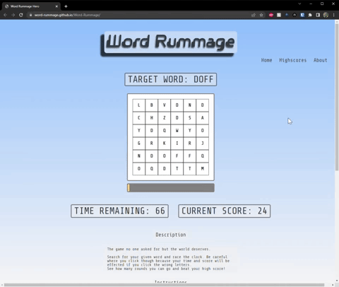

# Word-Rummage

**REFACTOR CAN BE FOUND [HERE](https://github.com/The-Dangerzone/WordRummage-FE)**

This is a [group project](https://github.com/Word-Rummage/Word-Rummage) I participated in at Code Fellows. It is hosted with GitHub Pages at [Word Rummage](https://word-rummage.github.io/Word-Rummage/).

Some of my personal contributions include:

- Sorting and rendering the highscores from local storage.
- Created the gameboard to be dynamic based on the round the player is on.
- Created the start and wipe gameboard functions.
- Created the board fill functions.
- Added functionality to verify user selection and give visual feedback.
- Participated in daily pair programming sessions.

## Group Members

- Brennan Malone
- Joe Davitt
- Adrienne Frey
- Ken Holt
- Jordan Covington

## Description

Word search game where the user will click through different tables and will only gain points upon selecting actual words. The game will continue to iterate until the participant runs out of time. The game will incorporate the letters and tables to perform as the MVP requirements.

## Wireframe

## Domain Model

